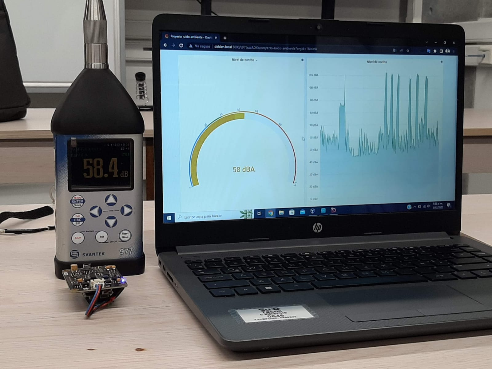
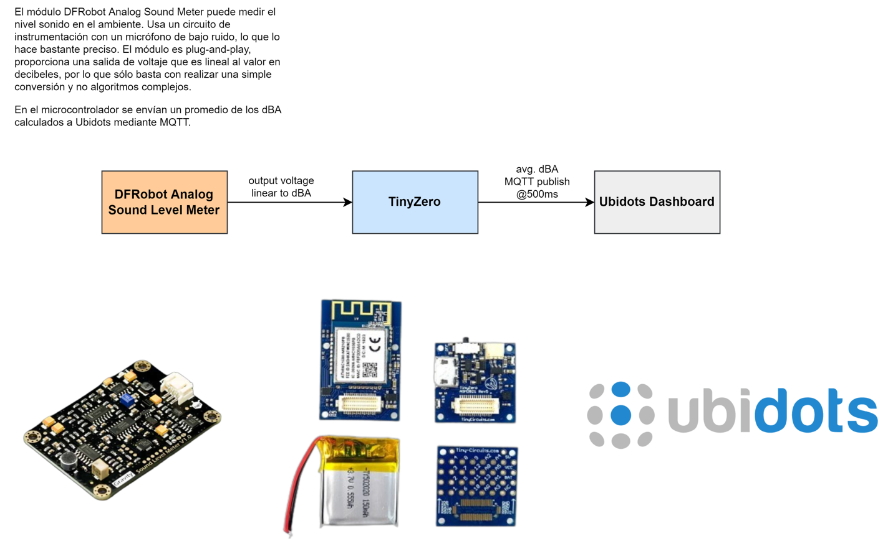

# Repositorio proyecto ruido ambiente

## Código en Arduino
Código en Arduino para prototipo basado en TinyZero y módulo DFRobot Analog Sound Meter para medición de nivel de sonido en dB y transmisión de datos mediante MQTT a servidor local Linux para visualización en tiempo real y envío de datos Ubidots. 

## Hardware

## Setup servidor Linux

### Docker

